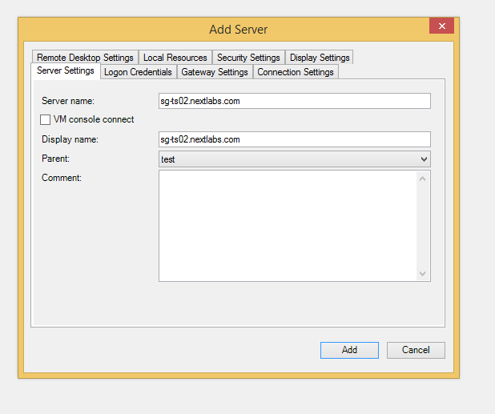
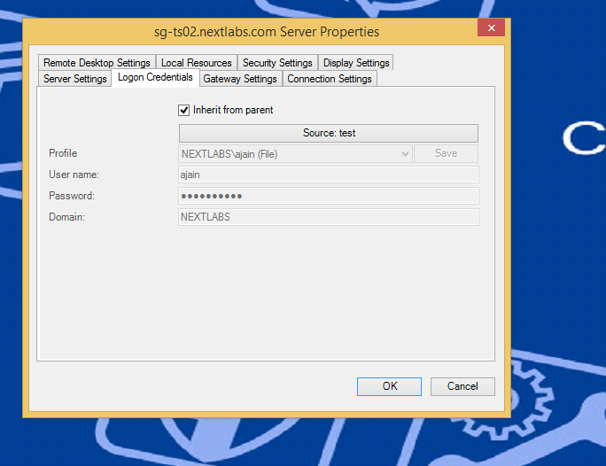
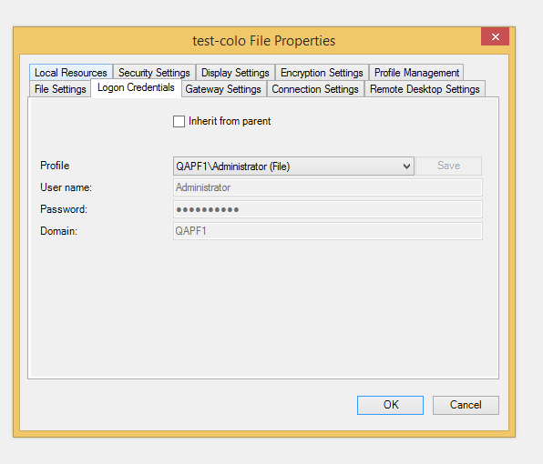
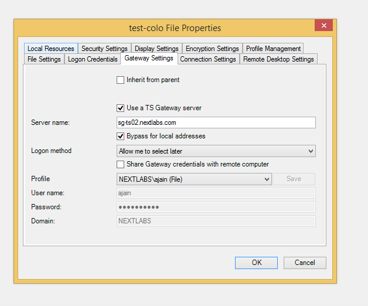
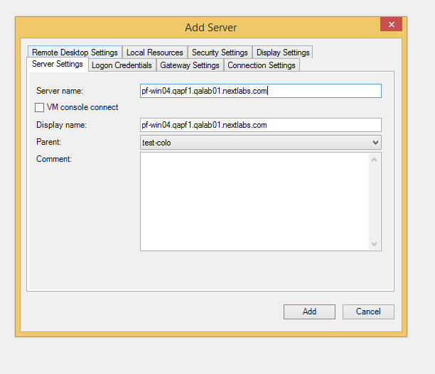

## Control Center (CC) on-premise Installation Guide 

### Steps 
#### Amazon S3 

[Direct Link](https://console.aws.amazon.com/s3/home?region=us-west-2#&bucket=nextlabspcv&prefix=nextlabs-share/Platform/8.0.3.999/ "Link to Amazon S3 Control Center builds repository")

1. Login to DevOps AWS account using your AWS credentials ([Link](https://console.aws.amazon.com))
2. Select Services > S3
3. From the bucket list:
    * select nextlabspcv
4. From the bucket list:
    * select nextlabs-share
5. Select Platform (for Control Center releases)
6. Select 8.0.3.999 (for 8.0.3 releases)
7. Select the build number you wish to download
8. There are different platform compatible versions for each nuild. Following methods are available to download build for desired platform -
    - Make Public
        * Right Click the file > select 'Make Public'
        * Choose 'Properties' tab at the upper right corner 
        * Copy 'Link' and download using 'Free Download Manager' on sg-ts01. Follow [Steps to follow on sg-ts01](#sgts01)
    - Direct Download
        + Right Click > Download
        + Right Click > Save Target As (Save it on a location on your system)
        >**Note:**
        >Session with S3 expires after a fixed interval. Therefore, depending on internet speed, this method is not generally recommended as download may not always complete.
    - Using AWS console
        + Copy the Link from 'Properties' tab without copying domain
        + Open AWS console on your local system
        + Type the following commands:
            * aws configure > input your AWS Access credentials (Access Key ID and Secret Access Key)
            * aws s3 cp \*copied link\*
        >**Note:**
        >Session with S3 expires after a fixed interval. Therefore, depending on internet speed, this method is not generally recommended as download may not always complete.

#### sg-ts01
1. Check (\\\storageserver\share\build\pcv) for existing download.
1. Download '<a>Free Download Manager</a>' (FDM)
        **Note:**
        **This document uses FDM. Any other downloader can be used**
2. Paste the copied URL from S3 in [FDM](#FDM)
3. Browse directories to download the file to C:/Downloads folder
4. Once the download is complete (should take around 10 minutes on nextlabs network), copy the downloaded file to location 

#### Local machine
1. Download 'Remote Desktop Connection Manager' (RDCM) on your local machine (**one time download**)
        **Note:**
        **This document uses RDCM. Any Remote Desktop Connection tool can be used**
2. To add sg-ts01 server: File > New File
    * Enter the file name (configuration file for the server to be added)
    * Right-Click > Add Server
    * Enter server details and user credentials (nextlabs login credentials). Hit save

3. To add QAPF1 VM machines: File > New File
    * Enter the file name (configuration file for the server to be added)
    * Set the properties File Settings, Logon Credentials and Gateway Settings as
    
    
        

4. Right-Click file name > Add Server
    * Fill the File Settings tab in Properties as follows
    
    * Inherit Logon Credentials, Gateway Settings from parent

#### VM
1. Login to the VM where you wish to install CC build from RDCM
2. Copy the build from (\\\storageserver\share\build\pcv) to the VM C:/Downloads directory
3. Extract the zip file
4. Double click install.bat
5. If VM has CC already installed:
    * Uninstall wizard starts. Click OK when asked to stop currently running service. 

    * Run install.bat again to install the new build.
    * **MS SQL Database Details:**
    <table>
        <tr>
            <td>Host</td>
            <td>ccsgdcsql2012.qapf1.qalab01.nextlabs.com</td>
        </tr>
        <tr>
            <td>IP</td>
            <td>10.23.58.123</td>
        </tr>
        <tr>
            <td>Port</td>
            <td>1433</td>
        </tr>
        <tr>
            <td>Username</td>
            <td>sa</td>
        </tr>
        <tr>
            <td>Password</td>
            <td>123blue</td>
        </tr>
        <tr>
            <td>Database Name</td>
            <td>_example:_ CC_WIN01</td>
        </tr>
    </table>

    > **_Note:_**
    > - Database Name are in sync with the VM Names _Example:_ pf-win01.qapf1.qalab01.nextlabs.com connects to CC_WIN01
    > - Make sure to delete all the Tables and Views from the selected database. You can use DBeaver on your local to connect to the database server and perform delete actions.
    > - To delete the views, use following script:
    > >     DROP VIEW dbo.policy_log_v1;
    > >     DROP VIEW dbo.policy_obligation_log_v1;
    > >     DROP VIEW dbo.tracking_custom_attribute_v1;
    > >     DROP VIEW dbo.tracking_log_v1;
    > >     DROP VIEW dbo.policy_custom_attribute_v1;
    > >     DROP VIEW.dbo.policy_attr_mapping_v2;
    > >     DROP VIEW.dbo.policy_custom_attribute_v2;
    > >     DROP VIEW.dbo.policy_log_v2;
    > >     DROP VIEW.dbo.APP_USER_VIEW;

